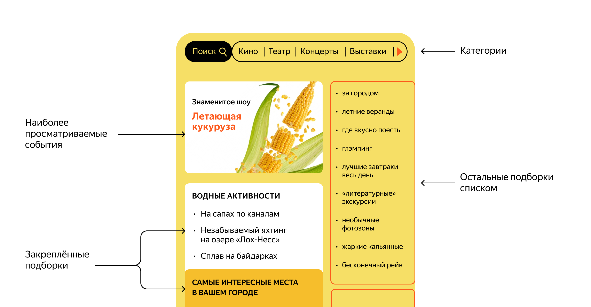

# Where-to-Go

_Афиша - приложение позволяет пользователям делиться информацией об интересных событиях и находить компанию для участия в них._


Вариант домашней страницы.
 
__Микросервисная архитектура:__
1) Основной сервис
   * содержит бизнес логику: создание событий, их модерация, обработка запросов участников, одобрение и отклонение заявок;
   * контроллеры с разграниченым досутупом по правам пользователя
   * для фильтрации используются динамические запросы QueryDSL
2) Сервис статистики
   * собирает и хранит статистику по каждому запросу
   * отправляет общую или персональную статистику

## 🎬 Как запустить

1. Склонировать проект.
    ```bash
   $ git clone https://github.com/gulllak/Where-to-Go.git
   ```
2. Установить Docker и docker-compose
3. Собрать проект
    ```
    mvn clean package
   ```
4. Запустить проект
   ```
   docker compose up -d
   ```

### 🏄 Стек: 
Java 11, SpringBoot 2, Docker, PostgreSQL, Spring Data JPA, REST API, QueryDSL, Lombok, MapStruct
